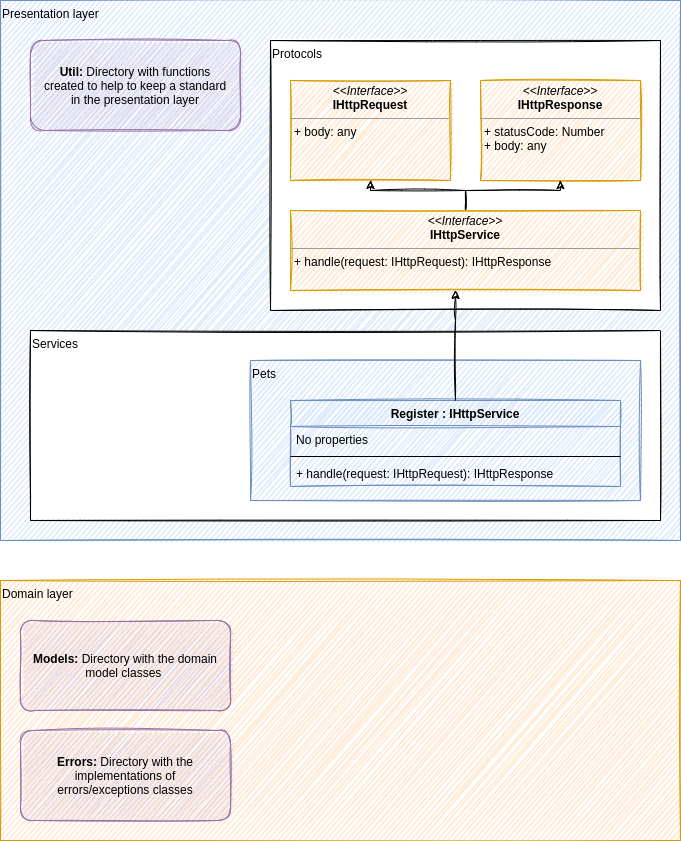

# 🐻 Back-end

The Pet Rescue back-end is responsible for providing an API to the front-end and mobile applications.

Pet Rescue is a solution developed to help people to announce and find lost pets living in the streets. Using the location (coordinates) provided by the user's device, Pet Rescue searches for our registered pets around the user's location and displays it to the user in an interactive map. Any user can, also, register new pets into the application with just a picture.

Our back-end uses the Clean Architecture pattern and we're using TDD to develop the application. Besides, ESLint is set with the Airbnb standard configuration and Prettier is also configured. The code-style is applied in every pre-commit and pre-push git hooks, using the `husky` and `lint-staged` libraries.

# 🖼️ Solution's architecture diagram

This project development is being driven by our architecture diagram. This diagram doesn't have any particular pattern, just being used as an easy and fast overview of the solution.

- The diagram project can be found inside the directory `./docs/architecture.png`.
- The tool used to control the diagram is [draw.io](https://app.diagrams.net/).
- Every new version must be available in the `.png` extension and replace the old one
    - You can open the `.png` file as a project, inside [draw.io](https://app.diagrams.net/)
    - When saving the project, after updating it, choose "File" -> "Export as" -> "PNG" and **check the option "Include a copy of my diagram"**. Then, replace the file with the old version by the exported (and new) one.

# 🧩 Technologies and frameworks

- Node
- Typescript
- Jest

# 📔 Read more

- [Environment setup](docs/environment-setup.md)
- (TO-DO) Project setup
- [Contributing](docs/contributing.md)

# 👨🏻‍💻 Commands list:

- Run tests: `yarn test`
